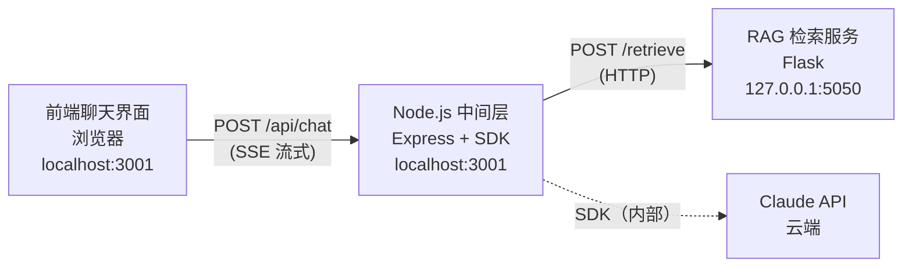
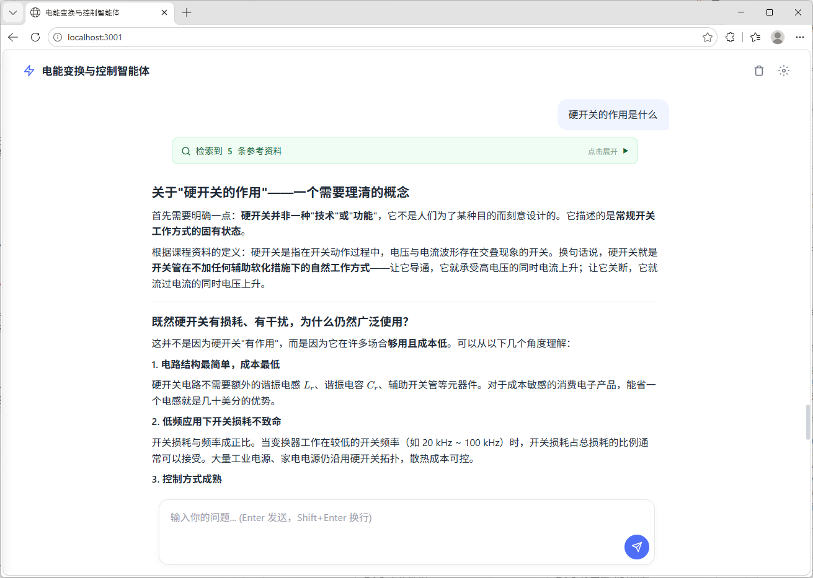
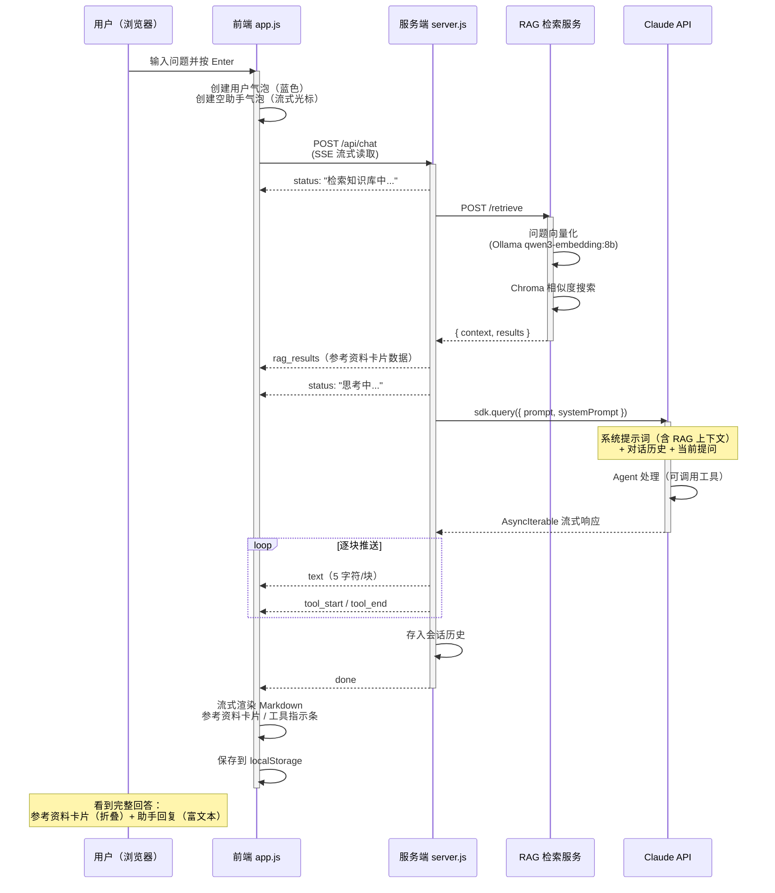

# 工作流集成与 Agent 界面

Agent Integration &amp; Chat Interface

[第二章](./02-local-rag-core.md) 搭建了一个可工作的 RAG 检索服务——它能接收问题、检索文档、返回上下文。但光有一个 JSON API 是不够的。用户需要的是一个**能对话的界面**：输入问题，看到检索了哪些资料，然后获得一个基于这些资料生成的、流畅自然的回答。

本章将 RAG 检索服务与 Claude Agent SDK 集成，构建起完整的工作流：用户提问 → 前端发送 → 服务端调用 RAG 检索 → 将上下文注入系统提示词 → Claude Agent 生成回答 → 流式返回前端渲染。同时搭建了一个带对话目录、检索结果展示和流式打字效果的聊天界面。

## 整体架构

整个系统由三个独立的服务进程组成，各司其职：



| 进程 | 技术栈 | 端口 | 职责 |
|------|--------|------|------|
| 前端聊天界面 | HTML + CSS + Vanilla JS | 3001（静态文件） | 用户交互、消息渲染、SSE 消费 |
| Node.js 中间层 | Express + Claude Agent SDK | 3001（API 端点） | 路由、会话管理、RAG 调用编排、SDK 调用、SSE 推送 |
| RAG 检索服务 | Flask + LlamaIndex + ChromaDB | 5050 | 文档检索、上下文拼接 |

三层解耦的设计意味着每个服务可以独立重启、调试和替换。RAG 检索服务不感知前端，Node.js 中间层不感知向量库的具体实现，前端不感知模型调用细节。

---
## 配置与环境

### .env 敏感信息管理

API Key 等敏感信息通过 `.env` 文件注入，不硬编码到源码中。项目提供 `.env.example` 模板：

```bash
# Anthropic API Key（必填）
ANTHROPIC_API_KEY=sk-ant-xxxxxxxxxxxx

# 模型选择（可选，默认 claude-sonnet-4-6）
ANTHROPIC_MODEL=claude-sonnet-4-6

# 前端服务端口（可选，默认 3001）
PORT=3001

# RAG 检索服务端口（可选，默认 5050）
RAG_PORT=5050
```

使用时将 `.env.example` 复制为 `.env` 并填入真实的 API Key。服务端通过 `dotenv` 包自动加载。

### 集中配置模块

`config.js` 将 `.env` 中的环境变量转化为具名导出，同时提供合理的默认值：

```javascript
export const PORT = process.env.PORT || 3001;
export const ANTHROPIC_MODEL = process.env.ANTHROPIC_MODEL || 'claude-sonnet-4-6';
export const RAG_API_URL = `http://127.0.0.1:${process.env.RAG_PORT || 5050}`;
export const MAX_HISTORY_ROUNDS = 40;   // 对话历史最大保留轮数
export const MAX_TOKENS = 8192;          // Agent 单次回复最大 token
```

所有可调参数集中一处，修改后重启服务即可生效，无需在多个文件中查找替换。

---
## 系统提示词

系统提示词是 Agent 的"人格设定"，定义它的角色、知识边界、行为风格和输出格式。在 `system-prompt.js` 中，提示词被设计为一个**接受 RAG 上下文参数**的函数，每次请求时动态生成。

### 结构设计

提示词按优先级分为六个层级：

| 层级 | 内容 | 作用 |
|------|------|------|
| 〇 | RAG 知识检索规则 | 最高优先级——要求模型以检索资料为准 |
| 一 | 知识覆盖范围（6 个模块） | 划定能力边界，超出范围诚实告知 |
| 二 | 五项核心能力 | 定义教学行为：引导式回答、苏格拉底式教学、电路分析、故障诊断、设计引导 |
| 三 | 教学策略 | 引导优先、分层讲解、知识关联、检验理解、深度控制 |
| 四 | 回复格式规范 | Markdown、LaTeX 公式、表格、禁止 emoji 和 ASCII 电路图 |
| 五 | 诚实与安全 | 不确定不编造、高压电安全警告 |
| 六 | 技能调用指引 | 按问题领域自动匹配对应的 Skill |

### RAG 上下文动态注入

提示词末尾包含一段动态内容——实时检索到的参考资料。`buildSystemPrompt(ragContext)` 接受检索上下文参数，将其直接嵌入系统提示词：

```
## 当前检索到的权威参考资料（RAG 实时注入）

[参考资料 1] 文件: power-device.md  |  章节: /定义/功率器件概述/功率器件的分类/
[定义 > 功率器件概述 > 功率器件的分类]
### 功率器件的分类
功率器件通常工作于高电压、大电流条件下，按导通与关断的可控性可分为三类...

**重要：以上参考资料是本问题的标准答案来源，回答时必须严格据此为准，不可编造。**
```

> **为什么放在系统提示词而不是用户消息中？**系统提示词在模型中拥有最高优先级。将 RAG 上下文放在系统提示词中，确保模型将其视为"必须遵守的指令"而非"仅供参考的对话内容"。放在用户消息中容易被模型忽略或稀释。

---
## Claude Agent SDK 集成

**Claude Agent SDK（`@anthropic-ai/claude-agent-sdk`）** 是 Anthropic 官方提供的 Node.js SDK，封装了与 Claude API 的通信细节——身份认证、请求构造、流式响应处理、工具调用管理等。使用 SDK 而非直接调用 HTTP API，可以省去大量基础设施代码，将注意力集中在业务逻辑上。

### SDK 初始化

SDK 采用**懒加载**模式——首次对话请求时才动态导入，避免启动时的初始化延迟：

```javascript
let agentSdk = null;
async function getAgentSdk() {
  if (!agentSdk) {
    agentSdk = await import('@anthropic-ai/claude-agent-sdk');
  }
  return agentSdk;
}
```

### 构造调用

每次用户提问，服务端构造一个完整的 Agent 查询请求。`sdk.query()` 接受两个核心参数：

- **`prompt`**：用户的对话上下文。服务端将最近 40 轮对话历史与当前提问拼接为 `用户: ... \n 助手: ... \n 用户: ...` 格式的纯文本。Agent SDK 将其作为用户消息发送给 Claude。
- **`options.systemPrompt`**：系统提示词。由 `buildSystemPrompt(context)` 动态生成，已包含本次检索到的 RAG 参考资料。
- **`options.permissionMode`**：设为 `'auto'`，允许 Agent 自主决定是否使用工具（Read、Write、Bash 等）。
- **`options.cwd`**：Agent 的工作目录，指向项目根目录。Agent 的 Skill 和工具调用在此上下文中执行。

```javascript
const stream = sdk.query({
  prompt,                     // 对话历史 + 当前提问
  options: {
    cwd: PROJECT_ROOT,        // Agent 工作目录
    systemPrompt: buildSystemPrompt(context),  // 系统提示词（含 RAG 上下文）
    permissionMode: 'auto',   // 允许 Agent 自主使用工具
    maxTokens: MAX_TOKENS,
    model: model || ANTHROPIC_MODEL,
  },
});
```

---
## 前端聊天界面

前端采用**零框架**方案——纯 HTML + CSS + Vanilla JavaScript，不引入 React、Vue 等前端框架。对于一个聊天界面而言，交互模式相对固定，Vanilla JS 足以胜任，且省去了构建工具链的复杂度。

### 界面结构



### 消息渲染

用户消息以纯文本展示，助手消息通过 **Marked** 库渲染为富文本。渲染管线集成了三种格式增强：

- **代码高亮**：围栏代码块（`\`\`\`` ）通过 **highlight.js** 按语言分类着色。
- **数学公式**：`$...$`（行内）和 `$$...$$`（块级）通过 **KaTeX** 渲染为排版级数学公式，适配电力电子课程中频繁出现的电压增益、伏秒平衡等公式表达。
- **复制按钮**：每个代码块右上角自动附加一个"复制"按钮，点击将代码内容写入剪贴板。

### 对话目录

点击 Header 中的标题文字，左侧滑出一个对话目录面板。它遍历当前会话中所有用户消息，截取前 60 个字符作为摘要，按序号排列。点击任意条目，目录收起，页面平滑滚动到对应的消息位置，并触发蓝色闪烁高亮动画。


---
## 消息数据持久化

聊天消息和 RAG 检索结果通过浏览器的 `localStorage` 持久化，刷新页面后对话历史不会丢失。

**存储策略：**

| 存储键 | 内容 | 更新时机 |
|--------|------|---------|
| `chat_messages` | 全部消息的 `[{role, content, id}]` 数组 | 每条消息发送/接收完成后 |
| `chat_ragResults` | RAG 卡片数据 `{assistMsgId: results[]}` 映射 | RAG 检索完成时缓存，消息结束时写入 |
| `chat_sessionId` | 当前会话 ID | 创建新会话时 |

刷新页面时，`loadFromStorage()` 按顺序恢复：先重建消息气泡，再为每条有 RAG 数据的助手消息重建参考资料卡片。清空历史时，三项存储一并移除。

## 完整请求生命周期

将以上所有组件串联起来，一条用户消息的完整处理流程如下：



---

工作流集成与 Agent 界面 · 风水master · 2026
