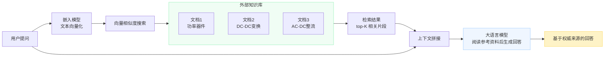
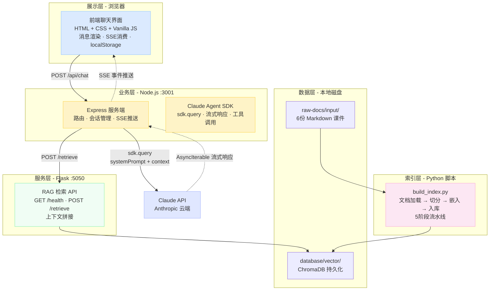
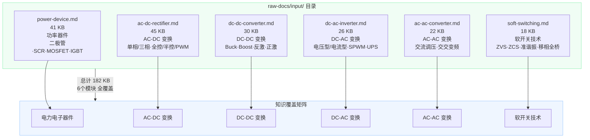
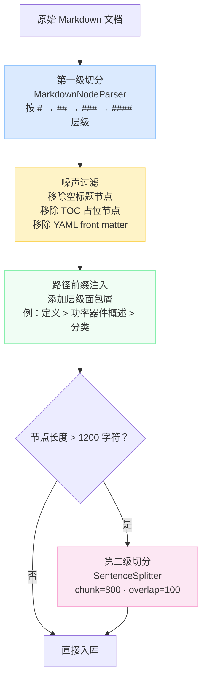
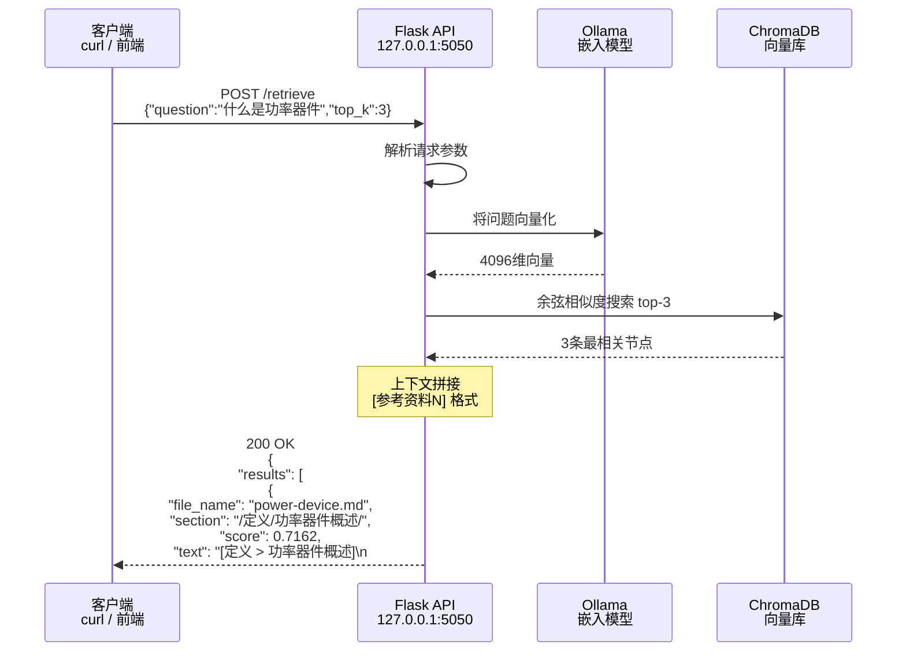
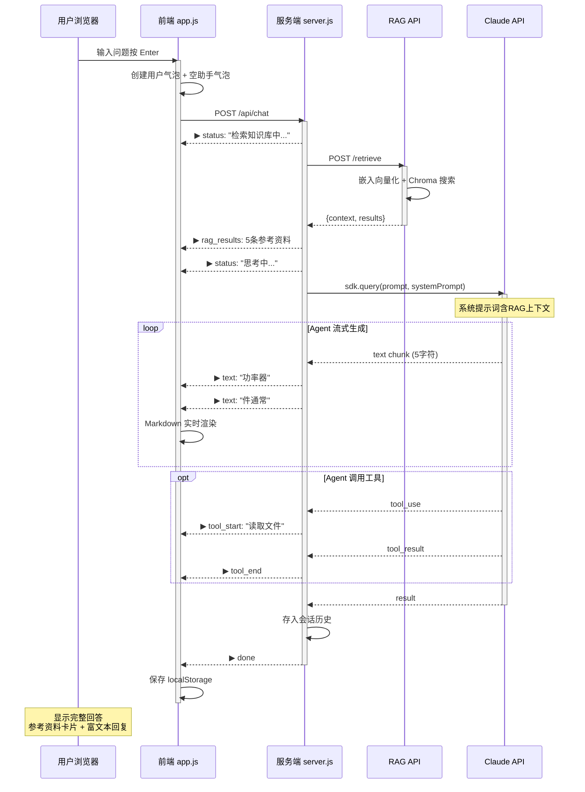
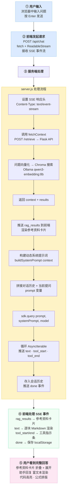
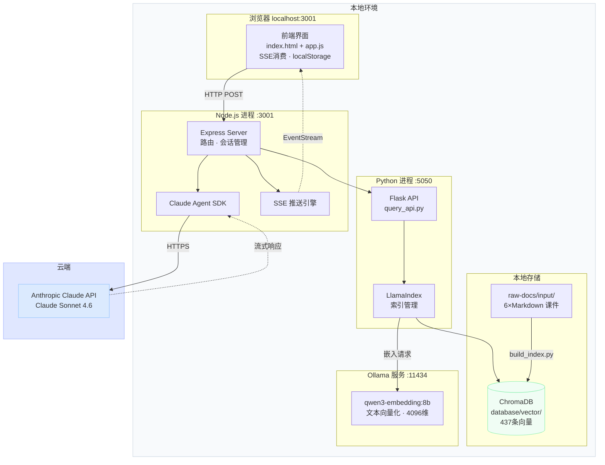

# 毕业论文插图

> 所有图片按论文中的图号排列。代码块使用 mermaid 语法，可在支持 mermaid 的编辑器或导出工具中直接渲染为矢量图。

---

## 图1-1  RAG 技术原理示意图



---

## 图2-1  RAG 工作流程图：用户提问 → 知识库检索 → 上下文注入 → 模型生成回答


---

## 图3-1  系统总体架构图（四节点五层架构）



---

## 图3-2  知识库六份文档的文件组织与内容覆盖示意图



---

## 图3-3  两级切分策略示意图：Markdown 层级切分 → 噪声过滤 → 路径注入 → 超长节点二次切分



---

## 图3-4  索引构建的终端输出示例

```
==================================================
[1/5] 正在从 raw-docs/input 加载文档...
     加载完成，共 6 个文档。
     已移除 &emsp;&emsp; 缩进。

[2/5] 使用 Markdown 标题层级切分...
     初始切分得到 568 个节点。
--- 初始节点统计 ---
总节点数: 568
文本长度: 最小 15 字符, 最大 3850 字符, 平均 321.5 字符
  [0, 200): 312 个节点
  [200, 500): 180 个节点
  [500, 1000): 52 个节点
  [1000, 2000): 18 个节点
  [2000, 5000): 6 个节点
     过滤噪声后剩余 481 个节点。
     已为每个节点注入层级路径。

[2.5/5] 超长节点二次切分...
--- 二次切分后 ---
总节点数: 437

[3/5] 初始化嵌入模型: qwen3-embedding:8b
     连接成功，嵌入维度: 4096

[4/5] 准备向量库: database/vector
     集合名称: smps_knowledge
     相似度度量: cosine

[5/5] 开始逐批嵌入写入...
     进度:  50/437 ( 11%) | 耗时:  12s | 剩余: 92s
     进度: 200/437 ( 45%) | 耗时:  48s | 剩余: 57s
     进度: 350/437 ( 80%) | 耗时:  84s | 剩余: 21s
     进度: 437/437 (100%) | 耗时: 105s | 剩余:  0s
     嵌入写入完成，总耗时 105.0s
     向量库实际条目数: 437 ✓

索引构建成功！总耗时: 115.2s
==================================================
```

---

## 图3-5  RAG 检索 API 的请求与响应示例截图



---

## 图3-6  系统提示词层级结构示意图（六层提示词 + RAG 动态注入）

```mermaid
graph TB
    subgraph SP[系统提示词体系 buildSystemPrompt context]
        direction TB
        L0[<b>第〇层</b>  RAG 知识检索规则<br/>以参考资料为准 · 不虚构]
        L1[<b>第一层</b>  知识覆盖范围<br/>6个模块 · 能力边界]
        L2[<b>第二层</b>  五项核心能力<br/>知识问答 · 计算指导 · 电路分析<br/>故障诊断 · 设计引导]
        L3[<b>第三层</b>  教学策略<br/>引导优先 · 分层讲解 · 知识关联<br/>检验理解 · 深度控制]
        L4[<b>第四层</b>  回复格式规范<br/>Markdown · LaTeX · 表格 · 代码块<br/>禁emoji · 禁ASCII电路图]
        L5[<b>第五层</b>  诚实与安全<br/>不确定不编造 · 高压安全警告]
        L6[<b>第六层</b>  技能调用指引<br/>问题领域 → 匹配课程内容]
    end
    
    RAG[RAG 动态注入层<br/>━━━━━━━━━━━━━━<br/>当前检索到的权威参考资料<br/>[参考资料 1] 文件: xxx 章节: xxx<br/>正文内容...<br/>━━━━━━━━━━━━━━<br/>以上参考资料为标准答案来源]
    
    SP --> RAG
    RAG --> Claude[发送至 Claude API]
    
    style L0 fill:#fee2e2,stroke:#fca5a5
    style RAG fill:#fef3c7,stroke:#fcd34d
    style Claude fill:#dbeafe,stroke:#93c5fd
```

---

## 图3-7  SSE 事件流时序图（从用户提问到完整回答的全链路事件序列）



---

## 图3-8  前端聊天界面截图（展示检索结果卡片、对话目录和流式回答）

> **说明：此图为浏览器截图，需实际运行系统后截取。** 画面应展示以下界面元素：

```
┌──────────────────────────────────────────────────────────────┐
│ ⚡ 电能变换与控制智能体                    🗑 清空  ⚙ 设置    │
├──────────────────────────────────────────────────────────────┤
│                                                              │
│  ┌──────────────────────────────────────┐                   │
│  │ 功率器件有哪些类型？                  │  用户消息（蓝色）   │
│  └──────────────────────────────────────┘                   │
│                                                              │
│  ┌ 🔍 检索到 5 条参考资料 点击展开 ▶ ──────────────────┐   │
│  │ ┌──────────────────────────────────────────────────┐│   │
│  │ │ ① power-device.md                       72%     ││   │
│  │ │   定义 › 功率器件概述 › 功率器件的分类          ││   │
│  │ │   功率器件通常工作于高电压、大电流条件下，      ││   │
│  │ │   按导通与关断的可控性可分为三类...             ││   │
│  │ └──────────────────────────────────────────────────┘│   │
│  │ ┌──────────────────────────────────────────────────┐│   │
│  │ │ ② power-device.md                       67%     ││   │
│  │ │   定义 › 功率器件概述 › 功率器件的分类          ││   │
│  │ │   全控型器件是指可以用控制信号控制其导通...     ││   │
│  │ └──────────────────────────────────────────────────┘│   │
│  └──────────────────────────────────────────────────────┘   │
│                                                              │
│  根据课程资料，功率器件按导通与关断的可控性可分为三类：      │
│                                                              │
│  **1. 不控型器件**                                           │
│  功率二极管，其导通和关断完全取决于外部电路条件...           │
│                                                              │
├──────────────────────────────────────────────────────────────┤
│ ┌──────────────────────────────────────────┐ [→]            │
│ │ 输入你的问题...                           │               │
│ └──────────────────────────────────────────┘               │
└──────────────────────────────────────────────────────────────┘
```

---

## 图3-9  完整请求生命周期流程图（五步链路）



---

## 图附-1  系统部署架构与各组件关系示意图



---

> 共 10 幅插图（图1-1 至 图附-1），9 幅为 mermaid 矢量图，1 幅（图3-8）为浏览器截图需实际运行截取。
